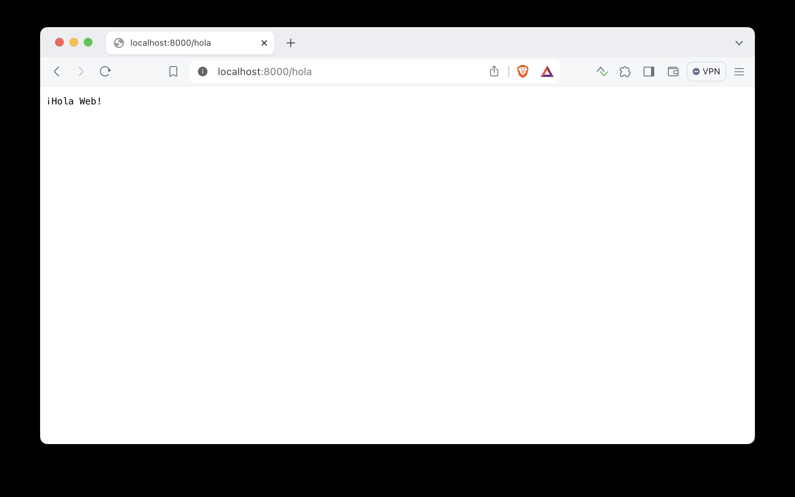
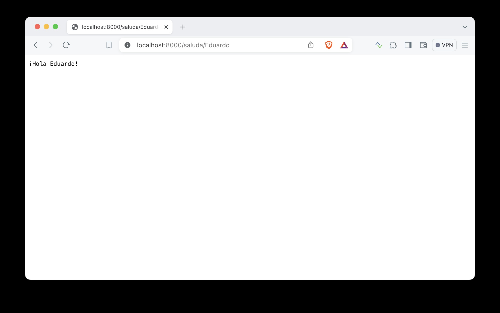

# Hola Web

Una característica de Go es que su biblioteca estándar es bastante rica en funcionalidades. Sobretodo en todo lo relacionado con la programación enfocada en redes. Con la versión 1.22 esto ha mejorado bastante, permitiéndonos crear un servidor web sin tener que descargar o instalar ningún framework o biblioteca especial. Veamos un ejemplo muy sencillo.

Al igual que con el caso del programa [HolaMundo](/parte-1/HolaMundo.md), creamos un módulo que llamamos `holaweb`:


        go mod init holaweb

Creamos el archivo `main.go` con el siguiente contenido:

```go
package main

import (
	"fmt"
	"net/http"
)

func main(){
  mux := http.NewServeMux()
  mux.HandleFunc("GET /hola", func(w http.ResponseWriter, r *http.Request) {
    fmt.Fprintln(w, "¡Hola Web!")
  })
  http.ListenAndServe(":8000", mux)
}
```

Luego ejecutamos este program del siguiente modo:

        go run main.go


Si abres tu navegador y escribes la dirección `http://localhost:8000/hola`, deberías ver una página como esta:



Ahora, para ver lo completa que puede ser la biblioteca http, vamos a agregar una url de la forma `/saluda/{nombre}`.

Para hacer esto agregamos el path del siguiente modo:

```go
  mux.HandleFunc("GET /saluda/{nombre}", func(w http.ResponseWriter, r *http.Request) {
    nombre := r.PathValue("nombre")
    fmt.Fprintf(w, "¡Hola %s!", nombre)
  })
```

Debes volver a ejecutar el programa después de hacer estos cambios (presiona ctrl-c para interrumpir tu pograma). Navega a la dirección `http://localhost/saluda/TuNombre` (reemplaza TuNombre con el tuyo). Deberías obtener esto:



Hay varios detalles en este código que vamos a ir aclarando más adelante. Por ahora, lo que quiero destacar es que la biblioteca estándar de Go nos permite crear aplicaciones muy complejas sin recurrir a instalar paquetes o bibliotecas adicionales. Vamos a aprovechar esto en futuros ejemplos.

Todo el código está disponible en la carpeta [hola-web](/parte-1/hola-web/).

[Volver al índice](../README.md)

