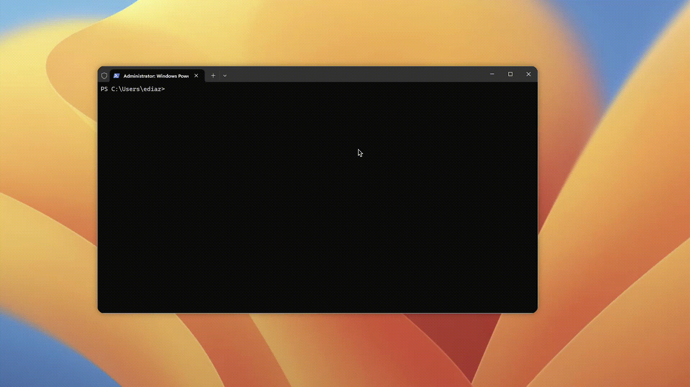
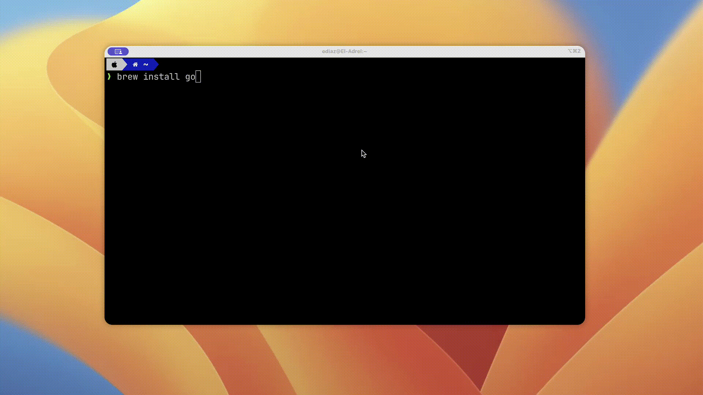

# Instala Go en tu máquina

Instalar Go en tu máquina es bastante sencillo. En el sitio oficial de Go: [https://go.dev/](https://go.dev/) hay iinstaladores, simplemente debes descargarlos y ejecutarlos.

Pero los profesionales usan un package manager. Acá te explico como instalar go en diversos sistemas operativos usando los package manager más populares:

## Instalando en Windows con Chocolatey

[Chocolatey](https://chocolatey.org/) es un gestor de paquetes para Windows bastante popular. Para instalar Go con este gestor ejecutas el siguiente comando en el terminal (en este caso estamos usando PowerShell)

        choco install golang -y

Tienes que abrir una nueva terminal para poder aplicar los cambios, y así podrás probar que todo esté instalado con el siguiente comando:

        go version

## Instalando en Mac con Brew

Debes tener instalado [brew](https://brew.sh/). Simplemente ejecutas:

    brew install go
    go version

## Instalando en Ubuntu 22

Ubuntu es una de las distros más populares, en este caso podemos usar apt para instalara Go.

        sudo apt update
        sudo apt upgrade
        sudo apt install golang-go

[Volver al índice](../README.md)
