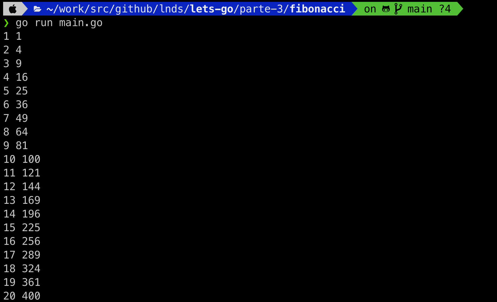
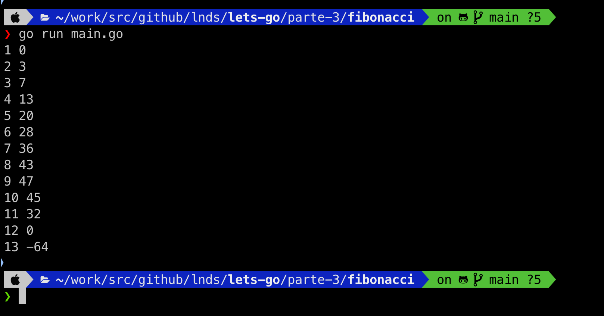

# Fibonacci Square

Una característica interesante de Go es su modelo de concurrencia, que está basado en dos pilares: go-routines y channels.

Vamos a introducir los channels con un problema muy sencillo.

Partiremos implementand, o simulando, generadores. Esta es una característica que encuentras en algunos lenguajes, como Python.

Primero vamos a implementar lo que representamos en este diagrama:

        +-----------+                   +-----------+              +-----------+
        |           |   0,1,2,3,...     |           |  0,1,4,9...  |           |
        |  Counter  |------------------>|  Squarer  |------------->|  Printer  |
        |           |    naturals       |           |  squares     |           |
        +-----------+                   +-----------+              +-----------+


Tendremos un generador que llamaremos Counter, que se encarga de generarl números naturales, que serán recibidos por Squarer, que es otro generador, que recibe estos números y los eleva al cuadrado, para pasarlos finalmente a Printer, que se encarga de recibir el resultado de Squarer e imprimirlo en pantalla.

Primero representemos ese diagrama en código del siguiente modo:

```go
package main

import "fmt"

func main() {
	naturals := make(chan int)
	squares := make(chan int)
	go Counter(100, naturals)
	go Squarer(naturals, squares)
	Printer(squares)
}
```

Las dos primeras líneas de `main` crean dos canales (channels). Estos canales pueden ser vistos como cañerías que aceptan números enteros en este caso, al hacer `make(chan int)`. Si necesito un channel con strings entonces lo creo del siguiente modo: `make(chan string)`.

Una vez que tenemos nuestros dos canales, que son el medio a través del cual nuestras funciones se comunicarán, las echamos a correr como go-routines.

Veamos la primera `Counter()`:

```go
func Counter(limit int, out chan<- int) {
	for x := 1; x < limit; x++ {
		out <- x
	}
	close(out)
}
```

La función recibe un límite en el parámetro `limit`, esto indica que generará los números desde 0 hasta ese valor. El segundo parámetro se llama `out` y el tipo es un channel que recibe enteros(`int`) y es de escritura (eso significa la notación `chan<- int`).

Noten que lo que hace `Counter` es ejecutar un loop para la variable `x` desde 0 hasta el número anterior a `limit`, y escribe ese número en el channel `out`, usando la notación `out <- x`. Al terminar el loop cierra el channel.

Ahora veamos la función `Squarer()`:

```go
func Squarer(in <-chan int, out chan<- int) {
	for x := range in {
		out <- x * x
	}
	close(out)
}
```

Esta función recibe dos channels, uno de entrada que hemos llamado `in` y otro de salida llamado, poco originalmente `out`. No se confundan, este canal no es el mismo que recibe la función `Counter()`. Hemos implementado ambas funciones de forma independiente del problema que estamos resolviendo, esto nos da independencia y la capacidad de componer estos resultados después.

Fíjense que un canal de lectura se declara así: `in <-chan int`. La regla nemotécnica es que la flecha va desde o hacia la palabra `chan`.

 Lo otro interesante es que el `for` ahora tiene esta forma: `for x := range in`.

 Acá vemos otro uso de la sentencia `range`, que se usa para recibir valores de un channel. Este loop correrá hasta que el canal se cierre.

 La magia ocurre entonces porque el chanel `out` de `Counter()` correspond al channel `in` de `Squarer()`, por eso que este código funciona como esperamos:

```go
    naturals := make(chan int)
	squares := make(chan int)
	go Counter(100, naturals)
	go Squarer(naturals, squares)
```

Acá `naturals` es el argumento `out` de `Counter()`, y a la vez es el argumento `in` de `Squarer()`. Y el channel `squares` corresponde al argumento `out` de `Squarer()`.

Ahora nos falta `Printer()` que es una especie de terminador, que recibe los resultados de la composición de las funciones anteriores y se encarga de imprimir los resultados en la consola:

```go
func Printer(in <-chan int) {
    i := 1
	for x := range in {
		fmt.Println(i, x)
        i++
	}
}
```

Si ejecutamos el programa se ve así:



## Fibonacci Square

Ahora nuestro desafío. Queremos saber que tanto crecen los números de Fibonacci comparados con los números elevados al cuadrado. Para saberlo vamos a implementar este pipeline:

        +-----------+                  +-----------+             
        |           |   0,1,2,3,...    |           |  0,1,4,9...  
        |  Counter  |----------------->|  Squarer  |---------------------\
        |           |   naturals       |           |  squares            |       +--------+     +-----------+
        +-----------+                  +-----------+                     |       |        |     |           |
                                                                         +------>|  Diff  |---->|  Printer  |
                                       +-----------+                     |       |        |     |           | 
                                       |           | 1,1,2,3,5,8,...     |       +--------+     +-----------+
                                       | Fibonacci |---------------------/       
                                       |           |   fibos
                                       +-----------+


Así como tenemos nuestro generador de números naturales, necesitamos un generador de números de Fibonacci, que tendrá el mismo nombre.

La implementación de esta función es la siguiente:

```go
func Fibonacci(out chan <- int) {
   a, b := 1, 1 
   for {
       out <- a
       a, b = b, a+b
   }
}
```

Noten que ejecutamos un loop infinito, eso no es problema, porque el limite lo pone tanto la función `Counter()` como la función `Diff()` que vamos a implementar a continuación.


```go
func Diff(a, b <-chan int, out chan<- int) {
    for {
        diff := 0
        select {
        case x := <-a:
            y := <-b
            diff = x - y 
        case y := <-b:
            x := <-a
            diff = x - y
        }
        out <- diff
        if diff < 0 {
            close(out)
            return
        }
    }
}
```


La función `Diff` correra hasta que encuentre una diferencia negativa, que es el punto en que la secuencia de Fibonacci es mayor que la secuencia cuadrática. En ese momento cerraremos `out`.

Noten el uso de `select` que es lo que nos permite trabajar con varios channels simultáneamente.

La lógica es la siguiente, `a` y `b` nos entregan dos números a comparar, lo que queremos es retornar la diferencia `a - b`. Entonces si hay algo en `a` leemos lo que esté en `b` y lo restamos. En el otro caso, si primero llega algo en `b` debemos dejarlo como un número negativo para lograr el efecto de restarlo de lo que venga en `b`.

Cada vez que hacemos `<-canal` la ejecución de la go-routine se bloquea hasta que exista un valor para tomar del channel.

Implementemos nuestra función `main()` modificándola un poco para que use estos nuevos elementos:

```go
func main() {
    naturals := make(chan int)
	squares := make(chan int)
    fibos := make(chan int)
    diffs := make(chan int)
	go Counter(100, naturals)
	go Squarer(naturals, squares)
    go Fibonacci(fibos)
    go Diff(squares, fibos, diffs)
	Printer(diffs)
}
```

Si ejecutamos este es el resultado:




