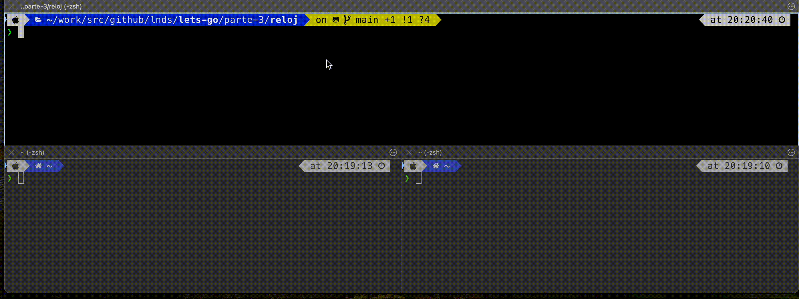
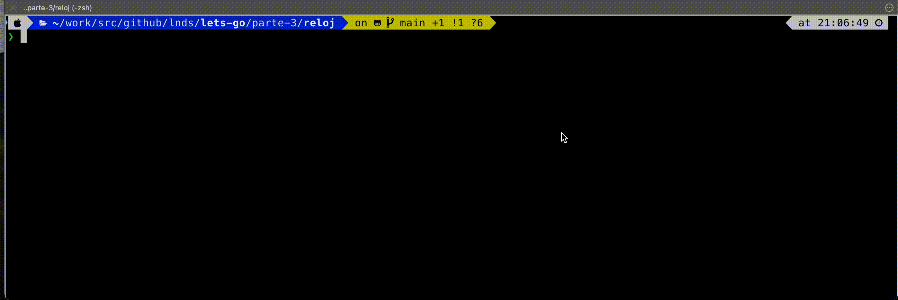

# Reloj No Marques Las Horas

Vamos a partir mostrando como puedes crear un servidor tcp/ip.

Como siempre creamos nuestro proyecto:

    mkdir reloj
    cd reloj
    go mod init reloj

## Un servicio tcp

Vamos a crear un servidor que estár escuchando en el puerto 8888 tcp, como hemos mencionado antes, la biblioteca estándard de Go tiene excelente soporte para esto en el package "net".

Editamos el archivo `reloj.go` y le agregamos el siguiente código:

```go
package main

import (
    "io"
    "log"
    "net"
    "time"
)

func main() {
    listener, err := net.Listen("tcp", "localhost:8888")
    if err != nil {
        log.Fatal(err) // finaliza el programa
    }
    for {
        conn, err := listener.Accept()
        if err != nil {
            log.Print(err) // por ejemplo el cliente cierra la conexión
            continue
        }
        handleConn(conn) // controla una conexión a la vez
    }
}
```

La función `main()` es relativamente fácil de entender. Primero abrimos un `listener` que estará escuchando en el puerto 8888 en localhost. Luego tenemos un ciclo infinito en que aceptamos una conexión (con el método `listener.Accept()`) e invocamos a la función `handleConn()` que será la que implemente la lógica de nuestro servicio.

La función `handleConn()` es la siguiente:

```go
func handleConn(c net.Conn) {
    defer c.Close()
    for {
        _, err := io.WriteString(c, time.Now().Format("15:04:05\n"))
        if err != nil {
            return // e.g., client disconnected
        }
        time.Sleep(1 * time.Second)
    }
}
```

La abstracción provista por el package `net` es que `Accept()` retorna un stream de datos abierto, cuando un cliente se conecta a nuestro servicio. Una vez que escribamos algo en este stream debemos cerrarnos, para esto usaremos la sentencia `defer c.Close()`, esto indica que el cierre de la conexión se realizará al finalizar esta función. En general `defer` ejecuta la llamada a la función que recibe cuando el programa sale del ámbito (o bloque de código) en que es declarado (señalado por las llaves `{}`).

Luego entramos en otro ciclo, en que escribimos la hora cada 1 segundo. La llamada `time.Now()` nos retorna la hora, y la función `time.Sleep(1 * time.Second)` detiene la ejecución del servicio por un segundo. Noten el uso de la unidad de tiempo, si quisieramos que duerma por dos hora escribimos `time.Sleep(2 * time.Hour)`.

Si el cliente cierra la conexión al momento de tratar de escribir en el stream se producirá un error, y retormamoscon lo que conexión se cerrara gracias al `defer c.Close()`.

Si ejecutas este programa e intentas establecer más de una conexión notarás que si bien acepta la segunda conexión, sólo responde a la primera, tal como se ve en este video:



La solución es sorprendentemente simple, basta cambiar la llamada a `handleConn()` del siguiente modo:

```go
go handleConn(conn)
```

De este modo la función `main()` queda así:

```go
func main() {
    listener, err := net.Listen("tcp", "localhost:8888")
    if err != nil {
        log.Fatal(err) // finaliza el programa
    }
    for {
        conn, err := listener.Accept()
        if err != nil {
            log.Print(err) // por ejemplo el cliente cierra la conexión
            continue
        }
        go handleConn(conn) // controla varias conexiones concurrentemente
    }
}
```

La sentencia go inicia una "go routine", es decir, ejecuta la llamada a la función de forma concurrente. Pueden pensar que es un "thread" o hilo liviano.

Este es el modelo de concurrencia preferido en Go, en este caso no nos interesa sincronizar nada entre cada go rutina, así que no tenemos nada más que explorar sobre este asunto, pero veremos más adelante en otro capítulo cómo podemos sincronizar e incluso comunicar dos go rutinas entre sí.

Si ejecutas ahora el programa con este cambio podrás ver que el servicio atiende varias sesiones en forma concurrente:


